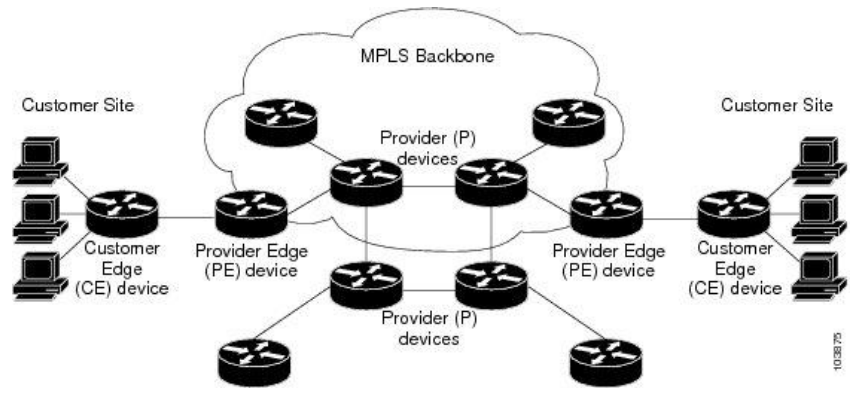

# NAS - Multi-Protocol Label Switching (MPLS)

Ce cours présente les concepts fondamentaux de **MPLS (Multi-Protocol Label Switching)**, en s'appuyant sur les bases de routage IP (RIP, OSPF, BGP) pour introduire la commutation d'étiquettes comme mécanisme d'optimisation et de services réseau.

## 1. Introduction et Motivation

Le routage IP traditionnel (NRP) repose sur l'analyse de l'en-tête de chaque paquet à chaque saut (hop-by-hop) pour déterminer la destination. MPLS introduit une approche différente basée sur des étiquettes (labels) pour plusieurs raisons :

* **Performance du cœur de réseau (Historique)** : Initialement, MPLS permettait d'éviter des recherches complexes dans les tables de routage IP globales au sein du cœur de réseau (P-routers).

* **Flexibilité de l'aiguillage (Packet Steering)** : Permet de décorréler la décision de l'ingress node (nœud d'entrée) du chemin suivi, sans impacter les tables de routage des nœuds intermédiaires.

* **Ingénierie de trafic (Traffic Engineering - TE)** : Offre la possibilité de réserver de la capacité le long d'un chemin spécifique pour garantir la Qualité de Service (QoS).

* **Réseaux Privés Virtuels (VPNs)** : Permet aux fournisseurs de services d'isoler le trafic de différents clients, même si ceux-ci utilisent des espaces d'adressage IP identiques (overlapping IP spaces).


## 2. Architecture du Plan de Données (Data Plane)

### 2.1 Concepts de base (RFC 3031)

Le principe fondamental de MPLS est l'encapsulation par étiquette :

* **Label (Étiquette)** : Un identifiant de longueur fixe et courte, ayant une signification locale, utilisé pour identifier une FEC.

* **FEC (Forwarding Equivalence Class)** : Un ensemble de paquets (ayant des propriétés similaires) qui sont traités de la même manière par un routeur. Une fois l'étiquette apposée, le routeur effectue l'opération associée sans analyser le contenu IP sous-jacent.


### 2.2 Signification et Distribution des Étiquettes

* **Signification locale** : Une étiquette "L1" sur un routeur R1 peut correspondre à une action différente de "L1" sur un routeur R2. Elle peut même être spécifique à une interface d'entrée (per interface label allocation).
* **Downstream Label Allocation** : C'est le nœud situé en aval (downstream) qui décide de la valeur de l'étiquette à utiliser pour un flux donné et la communique au nœud en amont (upstream).


* **Modes de distribution** :
* *Unsolicited downstream* : Le nœud aval diffuse l'étiquette spontanément.
* *Downstream on demand* : Le nœud amont demande explicitement une étiquette.


## 3. Opérations sur les Étiquettes (LSR Operations)

Un **LSR (Label Switching Router)** peut effectuer plusieurs opérations sur la pile d'étiquettes (label stack):

* **`PUSH`** : Ajoute une étiquette au sommet de la pile (généralement à l'entrée du réseau MPLS).
* **`SWAP`** : Remplace l'étiquette supérieure par une autre (opération standard dans le cœur du réseau).
* **`POP`** : Retire l'étiquette supérieure.
	* *Penultimate Hop Popping (PHP)* : Le routeur avant-dernier retire l'étiquette pour que le dernier routeur n'ait qu'à traiter le paquet IP final.
* **Combo** : Opérations combinées, par exemple un SWAP suivi d'un PUSH.


## 4. Plan de Contrôle (Control Plane)

Le plan de contrôle est responsable de la création et de la distribution des étiquettes entre les routeurs, c'est des protocoles. Les principaux protocoles sont :

* **LDP (Label Distribution Protocol)** : Protocole standard pour la distribution de labels basée sur le routage IGP.
* **RSVP-TE** : Utilisé pour l'ingénierie de trafic, permettant la réservation de ressources.
* **SR (Segment Routing)** : Evolution moderne de MPLS simplifiant le plan de contrôle en utilisant l'IGP pour distribuer les segments.
* **BGP** : Utilisé notamment pour la distribution de labels dans le cadre des VPNs IP (RFC 4364).


## 5. Considérations Techniques Additionnelles

* **Gestion du TTL** : Le TTL du paquet IP doit être géré lors de l'entrée et de la sortie du "tunnel" MPLS pour éviter les boucles (RFC 3032).
* **MTU** : L'ajout d'étiquettes MPLS réduit l'espace disponible pour la charge utile IP sur le support physique, ce qui nécessite une attention particulière à la taille maximale des paquets.


---


# NAS - LDP

Le protocole **LDP (Label Distribution Protocol)**, défini par la **RFC 5036**, est le protocole standard utilisé dans les réseaux MPLS pour distribuer les étiquettes (labels) en se basant sur les informations de routage fournies par les protocoles IGP (comme OSPF ou IS-IS).

## 1. La Relation de Voisinage (Discovery & Adjacency)

LDP fonctionne par étapes pour établir la communication entre deux routeurs adjacents (**LSR - Label Switching Routers**) :

* **Découverte (Hello) :** Les routeurs envoient des messages *LDP Hello* via UDP (port 646) à une adresse de multicast. Cela permet de découvrir les voisins directement connectés.
* **Établissement de session :** Une fois le voisin découvert, une session **TCP** est établie entre les deux routeurs pour garantir la fiabilité de l'échange des étiquettes.


## 2. Le Principe de Distribution "Downstream"

Dans LDP, la décision de la valeur de l'étiquette revient toujours au nœud situé en **aval (Downstream)** par rapport au flux de données.

* **Exemple :** Si le routeur R2 est le prochain saut (next-hop) pour atteindre une destination IP donnée, c'est R2 qui choisira une étiquette (ex: Label 42) et informera le routeur en amont R1 : "Pour cette destination, envoie-moi les paquets avec l'étiquette 42".


## 3. Modes de Distribution

Il existe deux manières pour un LSR de distribuer ses étiquettes à ses voisins :

* **Downstream Unsolicited (DU) :** Le routeur aval distribue ses étiquettes à ses voisins spontanément, sans qu'ils lui demandent. C'est le mode le plus courant.
* **Downstream on Demand (DoD) :** Le routeur en amont doit explicitement demander une étiquette pour une destination spécifique au routeur en aval.


## 4. Modes de Rétention des Étiquettes

Lorsqu'un routeur reçoit des étiquettes de plusieurs voisins pour une même destination, il a deux stratégies possibles :

* **Conservative Label Retention :** Le routeur ne conserve que l'étiquette provenant de son prochain saut actuel (celui indiqué par la table de routage IP). Il ignore les autres pour économiser de la mémoire.
* **Liberal Label Retention :** Le routeur conserve toutes les étiquettes reçues de tous ses voisins.
	* *Avantage :* En cas de changement de topologie (panne), le routeur peut immédiatement utiliser une étiquette de secours sans attendre un nouvel échange LDP, ce qui accélère la convergence.


## 5. Lien avec la FEC (Forwarding Equivalence Class)

LDP associe une étiquette à une **FEC**. Dans le cadre de LDP standard, une FEC correspond généralement à un préfixe IP présent dans la table de routage. **LDP "suit" donc simplement le chemin le plus court calculé par l'IGP (OSPF/IS-IS) pour construire les chemins de commutation d'étiquettes (LSP - Label Switched Paths).**


---


# NAS - RSVP et l'Ingénierie de Trafic (RSVP-TE)

## 1. Introduction et Cas d'Usage

Alors que LDP suit aveuglément les chemins calculés par l'IGP (Shortest Path First), **RSVP (RFC 2205)** a été conçu pour permettre aux hôtes et aux routeurs de demander des qualités de service (QoS) spécifiques à travers le réseau. Dans un contexte MPLS, on utilise **RSVP-TE (RFC 3209)** pour établir des chemins explicites appelés "tunnels".

**Pourquoi utiliser RSVP-TE ?** 

* **Chemins explicites :** Un client VPN peut exiger que son trafic évite certains nœuds ou liens physiques.
* **Disponibilité :** Un opérateur peut vouloir deux chemins strictement disjoints pour un flux critique (ex: flux TV "live-live").
* **Contraintes de ressources :** Déployer un service sensible au délai sur un réseau optimisé pour la bande passante par l'IGP.
* **Ingénierie de Trafic (TE) :** Orienter le trafic sur des liens sous-utilisés plutôt que de saturer le chemin le plus court.


## 2. Établissement d'un LSP (Path Establishment)

L'établissement d'un chemin avec RSVP-TE repose sur un échange de messages de contrôle entre le routeur d'entrée (Ingress) et le routeur de sortie (Egress).

### 2.1 Le message PATH

Le routeur Ingress initie la demande en envoyant un message **PATH** vers l'Egress.

* Ce message est traité saut par saut (hop-by-hop).
* Il contient un objet **ERO (Explicit Route Object)** qui liste les nœuds par lesquels le tunnel doit impérativement passer.
* Il contient également une **Flow Spec** définissant les ressources nécessaires (ex: 1 Gbps de bande passante).


### 2.2 Le message RESV

Si l'Egress accepte la requête, il répond par un message **RESV** qui remonte le chemin inverse vers l'Ingress.

* C'est lors de cette remontée que les **étiquettes MPLS** sont distribuées.
* Les ressources (bande passante) sont officiellement réservées dans chaque nœud à ce moment.


### 2.3 Maintenance et Suppression

* **Soft State :** RSVP maintient des états "mous" ; les messages doivent être renvoyés périodiquement pour maintenir la réservation.
* **PATH_TEAR / RESV_TEAR :** Utilisés pour supprimer explicitement un tunnel et libérer les ressources.


## 3. Gestion de la Capacité et QoS

Pour que RSVP-TE puisse choisir un chemin, il doit connaître l'état du réseau.

* **Découverte :** On utilise des extensions des protocoles de routage (ex: **OSPF-TE**, RFC 3630). Les routeurs diffusent des LSA (Link State Advertisements) incluant la capacité totale, la capacité réservable et la métrique TE des liens.
* **Admission Control :** Si deux routeurs tentent de réserver simultanément une capacité supérieure à ce qui est disponible sur un lien, le routeur recevant la requête PATH renvoie un **PATH Error**.


## 4. Protection et Résilience : Fast ReRoute (FRR)

L'un des grands avantages de RSVP-TE est sa capacité de réaction ultra-rapide en cas de panne (cible < 50ms).

* **Link Protection :** Des tunnels de secours sont pré-établis pour contourner un lien spécifique. En cas de coupure, le routeur en amont (Point of Local Repair) commute le trafic dans le tunnel de secours.
* **Make-Before-Break :** Si le chemin d'un tunnel doit être modifié, RSVP-TE établit le nouveau tunnel *avant* de supprimer l'ancien, garantissant ainsi qu'aucune perte de données ne survient durant la transition.


## 5. Limites et Évolution

Bien que puissant, RSVP-TE présente des défis:

1. **Complexité :** Maintenir des milliers d'états de tunnels dans chaque routeur est coûteux en ressources (problème de scalabilité).
2. **Optimisation Distribuée :** Chaque routeur décide de ses chemins indépendamment, ce qui peut mener à un réseau sous-optimal ou "chaotique".

Ces limites poussent aujourd'hui les réseaux vers une **centralisation de la stratégie** (via des contrôleurs SDN) ou l'adoption du **Segment Routing (SR)**, qui simplifie le plan de contrôle en supprimant le besoin de protocoles de signalisation comme RSVP.


---

# Cours : Réseaux Privés Virtuels (BGP/MPLS VPNs)

Ce cours sur MPLS traite de l'application la plus répandue en entreprise : les **L3VPN** (ou BGP/MPLS VPN), basés sur la **RFC 4364**. Ce chapitre fait la synthèse entre vos acquis sur BGP et les mécanismes de commutation d'étiquettes vus précédemment.

/!\ Genmini is probably telling bullsh\*t about route targets and route distinguishers /!\ 

**road target** are BGP extended communities (tags you add onto roads with policies associated to it).

## 1. Objectifs et Problématique

Un fournisseur de services souhaite offrir une connectivité de niveau 3 entre les sites distants d'un client, tout en utilisant une infrastructure partagée. Les défis sont :

* **Étanchéité** : Le client A ne doit pas pouvoir communiquer avec le client B.
* **Chevauchement d'adresses** : Deux clients différents peuvent utiliser les mêmes adresses privées (ex: `10.0.0.0/8`).
* **Scalabilité** : Le cœur du réseau (P-routers) ne doit pas avoir connaissance des routes des clients.


## 2. L'Architecture et les Rôles

Le réseau est divisé en trois types d'équipements :

* **CE (Customer Edge)** : Routeur chez le client. Il ne "parle" pas MPLS, il fait du routage standard (RIP, OSPF, BGP ou statique) vers le fournisseur.
* **PE (Provider Edge)** : Routeur de bordure du fournisseur. C'est la pièce maîtresse qui maintient la séparation des clients.
* **P (Provider)** : Routeur de cœur. Il se contente de commuter des étiquettes (LSR) sans jamais regarder les paquets IP des clients.



## 3. Mécanismes de Séparation et de Routage

### 3.1 VRF (Virtual Routing and Forwarding)

Pour gérer le chevauchement d'adresses, le PE utilise des **VRF**. Une VRF est une table de routage virtuelle indépendante. Chaque interface client sur le PE est associée à une VRF spécifique.

### 3.2 Distinguer les routes : Le Route Distinguisher (RD)

Pour que BGP puisse transporter des préfixes identiques appartenant à des clients différents dans le plan de contrôle, on ajoute un **RD** (64 bits) devant l'adresse IPv4.

* **IPv4 (32 bits) + RD (64 bits) = VPN-IPv4 (96 bits).**
* Le RD rend la route unique au sein du réseau du fournisseur.

### 3.3 Propager les routes : MP-BGP et Route Targets (RT)

On utilise **Multiprotocol BGP (MP-BGP)** pour échanger ces routes VPN-IPv4 entre PE.

* **Route Targets (RT)** : Ce sont des attributs BGP (Extended Communities) qui dictent l'importation et l'exportation des routes.
* *Export RT* : "Je marque mes routes avec cette étiquette."
* *Import RT* : "J'accepte dans cette VRF toutes les routes portant cette étiquette."


## 4. Plan de Données : La Double Pile d'Étiquettes

Le transfert des données repose sur l'utilisation de **deux étiquettes** MPLS (Label Stack) :

1. **L'étiquette de service (VPN Label)** : Ajoutée par le PE d'entrée, elle est apprise via MP-BGP. Elle indique au PE de sortie à quelle VRF (quel client) appartient le paquet.
2. **L'étiquette de transport (IGP/LDP Label)** : Ajoutée au-dessus de la première. Elle permet d'acheminer le paquet à travers le cœur du réseau jusqu'au PE de sortie (établie par LDP ou RSVP-TE).


## 5. Synthèse du trajet d'un paquet

1. Le **CE1** envoie un paquet IP classique au **PE1**.
2. Le **PE1** identifie la VRF, consulte sa table et encapsule le paquet avec :
* L'étiquette VPN (bas de pile).
* L'étiquette LDP pour atteindre le PE distant (haut de pile).


3. Les routeurs **P** commutent uniquement l'étiquette supérieure (LDP).
4. Le **PE2** reçoit le paquet (souvent après un PHP), regarde l'étiquette VPN restante, identifie la VRF de destination et transmet le paquet IP "nu" au **CE2**.


---


# Segment Routing (SR)

## 1. Introduction

Le **Segment Routing (SR)** est une architecture de routage introduite dans la **RFC 8402**.
Elle repose sur le principe de **source routing**, où **le routeur d’entrée du réseau (ingress)** décide du chemin que les paquets doivent suivre.

SR MPLS = MPLS avecconctrol plane différent 

- extensions MPLS 
- remplacer LDP par OSPF extension
- routeur annonce dans une extension de LSP les node segment : 
- **node SiD** -> {Label Value}
	- **Label Value** unique dans le réseau, correspond à une instruction = forward sur le chemin le plus court vers N 
- **Adj-SiD** -> étiquette Locale sur le node : "pop and forward" = forwardder abeuglément cers le noeud suivant 
- chaquenode envoie ses adjacencies à tout le monde (dans des LSP OSPF)

OSPF plutôt que LDP : LDP necessite que tout le monde ait une session LDP fonctionnelle, donc on met sur ospf pour être sûr que ça fonctionne sans config spéifique (OSPF tombe bcp moins facilement que LDP). LDP ne s'établit pas automatiquement comme OSPF.

**PHP** : pop l'étiquette pour envoyer le paquet sans instruction au dernier node. 

## 2. Principe du Source Routing

Dans le **source routing**, le routeur d’entrée :

* choisit un chemin dans le réseau,
* encode ce chemin dans le paquet,
* laisse les routeurs intermédiaires appliquer les instructions.

Le trafic est donc **dirigé explicitement par le routeur d’entrée**, sans nécessiter de signalisation complexe dans le réseau. L’intelligence du réseau est déplacée vers les nœuds d’entrée.

Avantages : 

* moins de protocoles de contrôle
* meilleure maîtrise des chemins
* simplification de l’infrastructure MPLS


## 3. Les Segments

Un **segment** est une **instruction donnée au réseau**.

On peut voir un segment comme une étape ou une action à appliquer au paquet.

Deux grandes catégories existent : 

**Segments topologiques** : décrivent un **chemin dans le réseau**.

	« aller vers ce routeur »
	« passer par ce lien »

**Segment de service** : indiquent qu’un paquet doit passer par **une fonction réseau**.

	firewall
	NAT
	fonction de service (service chaining)


## 4. Segment Identifier (SID)

Chaque segment est identifié par un **SID (Segment Identifier)**.

Un SID est une **valeur numérique** qui représente une instruction.

Il existe deux types de SID :

- **SID global** : reconnu par **tous les routeurs du domaine SR**, a la **même signification dans tout le réseau**

- **SID local** : reconnu uniquement par **un routeur spécifique**

Les SIDs sont généralement annoncés dans les protocoles de routage comme **OSPF ou BGP**. 


## 5. Segment List

Une **Segment List** est une **liste ordonnée de SIDs** = **suite d’instructions** que le paquet doit suivre, genre _"va vers R2 puis R5 puis R8"_ :

	[SID R2] → [SID R5] → [SID R8]


## 6. Opérations sur les segments

***Active Segment***

À chaque instant, **un seul** segment est actif : le  **`Active SID`** _(omg fallait la trouver celle là)_. C’est l’instruction actuellement exécutée.

**Opérations**

Deux opérations sont possibles :

- **`CONTINUE`** = L’instruction n’est pas terminée. Le routeur effectue son traitement et laisse le segment actif.

- **`NEXT`** = L’instruction est terminée. Le routeur passe au **segment suivant dans la liste**.


## 7. Segments annoncés par les protocoles Link-State

Les protocoles de routage **OSPF ou IS-IS** peuvent annoncer des segments.
Cela est défini dans **RFC 8665**. 
Deux types principaux existent.

### Node Segment (Node SID)

Le **Node SID** est l’instruction :

> “Envoyer le paquet vers ce routeur en utilisant le plus court chemin.”

Caractéristiques :

* **global**
* annoncé dans l’IGP
* identique pour tous les routeurs

Traitement :
```
Si le routeur **n’est pas la destination** :
-> il transfère le paquet vers le prochain saut du chemin le plus court.

Si le routeur est **l’avant-dernier saut (penultimate hop)** :
-> il retire le SID (PHP : Penultimate Hop Popping).

Si le routeur est **la destination** :
-> il passe au segment suivant.
```

### Adjacency Segment (Adj SID)

Le **Adjacency SID** indique :

> “Utiliser ce lien spécifique de ce routeur.”

Caractéristiques :

* **local**
* défini par le routeur
* uniquement interprété par lui.

Traitement :

	NEXT → envoyer sur le lien spécifié


## 8. Segments BGP

Segment Routing peut aussi utiliser **BGP pour annoncer des segments**.
Deux types principaux :

### BGP Prefix Segment

Instruction :

	"aller vers un préfixe via le plus court chemin"

Caractéristiques :

* **global**
* annoncé via BGP

### BGP Peering Segment

Instruction :

	utiliser un lien de peering BGP spécifique

Caractéristiques :

* **local**
* interprété uniquement par le routeur concerné.


## 9. Binding Segment

Les **Binding SIDs** identifient des **listes entières de segments**. Genre `Binding SID 1 <=> [SID1 SID2 SID3 SID4]`.

Avantages :

* simplifie la gestion
* réduit la taille des listes
* améliore la scalabilité du réseau.


## 10. Dataplanes du Segment Routing

Segment Routing peut fonctionner sur deux types de dataplanes.

### SR-MPLS

Principe (RFC 8663) : La **Segment List est une pile MPLS** (cf les étiquettes des cours d'avant)

Chaque routeur :

* **`SWAP`** pour continuer (=`CONTINUE`)
* **`POP`** pour passer au segment suivant (=`NEXT`)

### SRv6

Segment Routing peut aussi fonctionner avec **IPv6** (RFC 8986) : La **liste de segments est une liste d’adresses IPv6** stockée dans un **Routing Header IPv6 (SRH)**.

Fonctionnement :

* le **SID actif = adresse de destination IPv6**
* lorsque l’instruction est terminée :
	* le prochain SID devient la nouvelle destination.


## 11. Optimisation SRv6

_(Gépakompri mais ça a pas l'air important)_ Les adresses IPv6 font **128 bits**, ce qui peut être trop grand.

Solutions proposées :

* **uSID**
* **cSID**

Principe :

* stocker plusieurs segments dans une seule adresse IPv6
* utiliser un mécanisme de **bit shifting**.

Ces mécanismes sont encore en cours de normalisation.


## 12. Applications du Segment Routing

### Traffic Engineering (SR-TE)

Le routeur d’entrée peut programmer un chemin précis. Cela permet d' :

* éviter la congestion
* utiliser des chemins alternatifs
* optimiser l’utilisation du réseau.

Contrairement à MPLS-TE : **il n’y a pas de réservation de ressources.**

### Fast Reroute

Segment Routing permet des mécanismes de protection rapide comme **TI-LFA (Topology Independent Loop Free Alternate)** qui permet de rediriger le trafic en cas de panne en **quelques millisecondes** (convergence très rapide pas de recalcul complet du réseau).

---


Ce dernier chapitre fait le lien entre les technologies de transport (MPLS), de service (VPN) et la gestion des ressources. Dans un environnement **BGP/MPLS VPN**, la **Qualité de Service (QoS)** est cruciale car les clients paient pour des contrats de niveau de service (SLA) stricts.

---

	coucou je me suis arrêté là

# Qualité de Service (QoS) 

## 1. Pourquoi la QoS ?

Dans un réseau mutualisé, plusieurs types de trafic coexistent. Sans QoS, un flux massif (ex: BitTorrent) pourrait dégrader les performances d'applications critiques (ex: VoIP, Gaming, ERP).
Les objectifs sont :

* Garantir des ressources (ex: "Je veux 1 Gbps entre le PoP A et le PoP B").
* Respecter les contraintes de délai (latence) et de gigue.
* Prioriser certains clients ou applications par rapport à d'autres.


## 2. Deux Philosophies : IntServ vs DiffServ

Le cours distingue deux modèles architecturaux pour gérer cette qualité :

### 2.1 Modèle Integrated Services (IntServ - RFC 1633)

* **Principe** : Réservation de ressources de bout en bout avant l'envoi des données.
* **Outil** : Utilisation du protocole **RSVP**.
* **Fonctionnement** : Chaque routeur sur le chemin maintient un état de la réservation et réserve une queue de sortie dédiée.
* **Inconvénient** : Problème de **scalabilité**. Maintenir des milliers d'états individuels dans le cœur du réseau (P-routers) est trop lourd pour les équipements.

### 2.2 Modèle Differentiated Services (DiffServ - RFC 2475)

* **Principe** : Priorisation basée sur le marquage des paquets. C'est le modèle dominant dans les réseaux MPLS actuels.
* **Fonctionnement** : À l'entrée du réseau (**Edge**), on vérifie la conformité du trafic et on le marque. Dans le cœur (**Core**), on traite les paquets par agrégats selon leur marqueur.
* **Avantage** : Très scalable, car le cœur ne gère que quelques classes de service au lieu de milliers de flux individuels.


## 3. Les Outils du Plan de Données (Forwarding Plane)

Pour mettre en œuvre la QoS, les routeurs utilisent plusieurs mécanismes :

* **Classifier (Classifieur)** : Identifie le type de trafic (par IP, port, ou étiquette MPLS) pour l'assigner à une classe.
* **Meter (Compteur)** : Mesure le débit du flux pour vérifier s'il respecte le contrat (SLA).
* **Marker (Marqueur)** : Inscrit une valeur dans l'en-tête (ex: bits EXP dans le label MPLS) pour que les routeurs suivants sachent comment traiter le paquet.
* **Shaper / Policer** :
* *Policer* : Rejette immédiatement le trafic qui dépasse le débit autorisé.
* *Shaper* : Lisse le trafic en mettant les paquets excédentaires en mémoire tampon (buffering) pour les envoyer plus tard.

* **Scheduler (Ordonnanceur)** : Gère les files d'attente de sortie (Queuing) pour décider quel paquet sort en premier (ex: Priority Queuing pour la voix, Weighted Fair Queuing pour le reste).


## 4. QoS et Commutation d'étiquettes MPLS

Dans un environnement VPN, le marquage est spécifique :

* Le champ **Traffic Class (TC)**, anciennement appelé bits **EXP** (3 bits dans le label MPLS), est utilisé pour porter l'information de QoS à travers le réseau MPLS.
* Lors de l'encapsulation au niveau du PE (Provider Edge), la valeur de priorité IP (DSCP) peut être copiée dans le label MPLS pour que les routeurs P puissent appliquer la QoS sans avoir à regarder l'en-tête IP du client.


## 5. Ingénierie de Trafic (TE) : Le complément de la QoS

La QoS seule (gestion des files d'attente) ne suffit pas si un lien est physiquement saturé.

* On utilise alors **RSVP-TE** ou **Segment Routing (SR)** pour détourner certains flux vers des chemins moins congestionnés, même s'ils sont plus longs.
* C'est la différence entre "mieux gérer l'attente à un guichet" (QoS) et "ouvrir une nouvelle route pour éviter les bouchons" (Traffic Engineering).


### Résumé pour l'examen

* **IntServ** = Réservation forte (RSVP), peu scalable.
* **DiffServ** = Marquage (DSCP/EXP) et agrégation, très scalable.
* **PE (Edge)** = Classification, Marquage, Policing.
* **P (Core)** = Ordonnancement simple basé sur les classes d'agrégats.


# DS NAS 2024

## 1. BGP/MPLS VPN

**Q1 BGP/MPLS VPN** : illustrez et décrivez le parcours d'un paquet IP partant d'un PC attaché à un CE d'un client BGP/MPLS VPN vers un hôte situé derrière un CE du même client, de l'autre côté de notre réseau. il y a deux routers P1 et P2 sur le chemin entre les PE attachés à ces CE. La joignabilité des routeurs MPLS du réseau est assurée par LDP. 

```
PC---CE1---PE1---P1---P2---PE2---CE2---host
```

- quelles sont les opérations effectuées dans le data-plane, à chaque saut ?
- décrivez les mécanismes protocolaires du control-plane qui ont amené à ces opérations.
- À quoi sert la configuration de VRF sur mes PE ?

## 2. MPLS

**Q2 TTL** : J'effectue un traceroute de CE à CE à travers mon réseau VPN, que se passe-t-il ?

**Q3 SR** : Illustrez et expliquez le parcours d'un paquet MPLS d'un noeud S vers un noeud D, dans un réseau OSPF supportant Segment Routing, pour lequel un chemin alternatif au chemin le plus court a été défini sur S. Expliquez les mécanismes de control-plane qui ont ammené à ces opérations.


